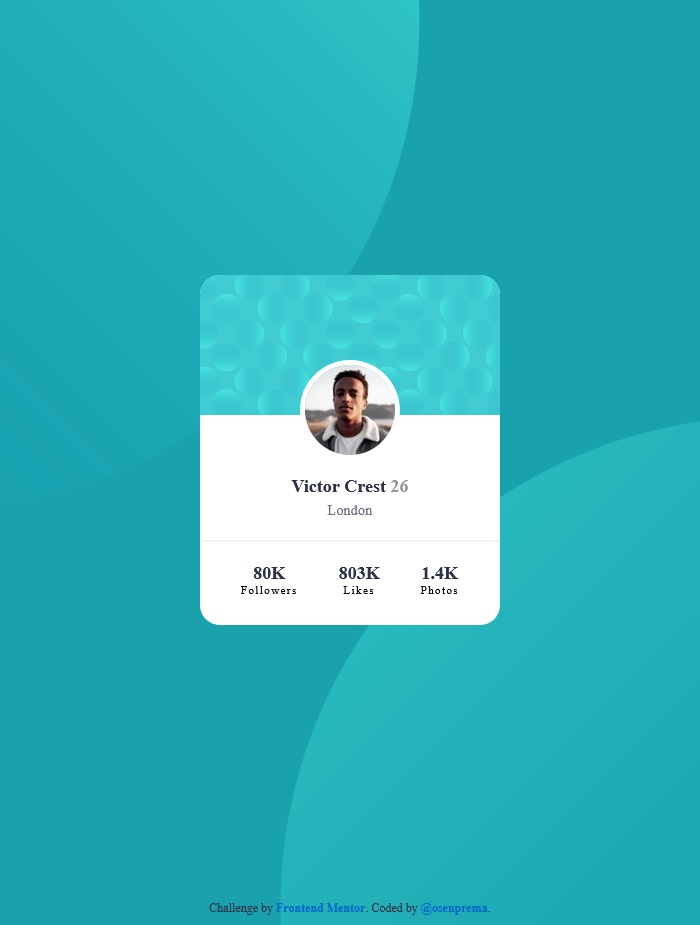

# Frontend Mentor - Profile card component solution

This is a solution to the [Profile card component challenge on Frontend Mentor](https://www.frontendmentor.io/challenges/profile-card-component-cfArpWshJ). Frontend Mentor challenges help you improve your coding skills by building realistic projects. 

### Screenshot



### Built with

- Semantic HTML5 markup
- CSS custom properties
- Flexbox
- Mobile-first workflow

### What I learned

With this challenge, I learned how to work with SASS and how to use several images as a page background.

```css
body {
  background-image: url("../assets/images/bg-pattern-top.svg"), url("../assets/images/bg-pattern-bottom.svg");
  background-repeat: no-repeat, no-repeat;
  background-color: #19a2ae;
  background-position: right calc(100vw * 0.43) bottom calc(100vh * 0.43), left calc(100vw * 0.43) top calc(100vh * 0.43);
}
```

## Author

- Frontend Mentor - [@osenprema](https://www.frontendmentor.io/profile/osenprema)